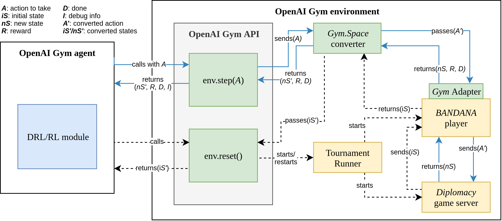

# gym-diplomacy

This repository contains the source code for a Diplomacy Open AI Gym that uses [BANDANA](https://www.iiia.csic.es/~davedejonge/bandana/) as game engine.

It is the code used for my [Master's thesis](https://repositorio-aberto.up.pt/handle/10216/121252) for the Software Engineering and Computer Science degree at FEUP. The state and action structure used were also published as a [paper](https://link.springer.com/chapter/10.1007/978-3-030-30241-2_5).

The agent is capable **only** of negotiating. The tactical plays are made by the [D-Brane](https://link.springer.com/article/10.1007/s10489-017-0919-y) player.

## Arquitecture

The conceptual diagram of this project:



## Directory structure

### agents

This directory contains the code for custom RL agents that were created for training.

### java-modules

This directory contains all the Java modules. At the moment only BANDANA and the OpenAIAgent are in it.

### protobuf

This directory contains the Protobuf messages that are exchanged between modules.

### python-modules

This directory contains all the Python modules for developing the environment.

## Running

The recommended way to install and run this environment is using Docker, as it contains a lot of depencies.

To run with Docker, you must first build the Java artifacts using `mvn package`. Then simply build the Dockerfile in the root of this directory:

``` bash
docker build --rm -f "Dockerfile" -t dip-q:latest .
```

This will create an image with every dependency needed to execute the project. The default environment for the image is `development`, which means you are able to compile Java code and run Maven inside the container.

To run a container and navigate inside:

``` bash
docker run --rm -it dip-q:latest
```
